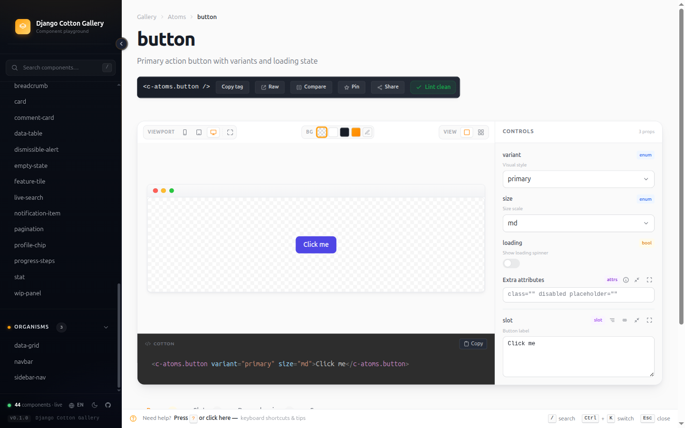
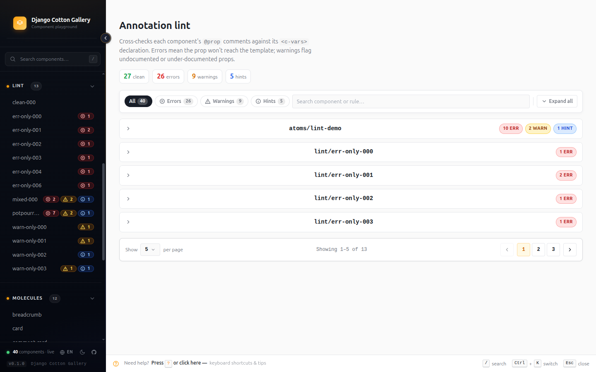

## The problem

There was nothing **native** for previewing Cotton components.

Storybook exists, and from what I researched it can be integrated into Django. But it does not get
you far: it does not really let you work. It is a tool built for another ecosystem, and you feel it
at every step.

And there is an underlying limit no editor extension can get around: **because of where it lives, it
cannot render the component the way the user designed it**. The editor does not run your Django
project, so it has none of your styles, your context or your configuration.

To actually see the component, you have to be inside the project.

## What it is

A playground for <a href="https://django-cotton.com/" target="_blank" rel="noopener noreferrer">Django Cotton</a> component libraries. It installs into
an existing Django project and exposes a browsable gallery of its components.

What it ships:

- **Live playground.** Every component renders with **controls generated automatically from its
  `@prop` annotations**. Change a prop and see it immediately. Copy the tag and you are done.
- **Lint report** with three severity tiers — errors, warnings and hints — for `@prop`/`<c-vars>`
  mismatches, missing descriptions and undeclared variables.
- **Insights dashboard**: config health, annotation coverage, **zombie components** and a
  most-referenced ranking. Catch the rot before it ships.
- **`Ctrl+K` switcher** with structured filters: `prop:size`, `slot:actions`, `accepts-attrs`,
  `has-named-slots`, `deprecated`.
- **Refactor planner** with the transitive dependency tree, a form-based **annotation builder**, and
  a **side-by-side compare** view.
- **Interface in four languages**: English, Spanish, Basque and French.



### The other half

[django-cotton-props](/en/projects/django-cotton-props/) does **the same job**: help you write
components and catch mistakes. What differs is where each one lives and what it can show.

<div class="table-scroll">
<table>
  <thead>
    <tr><td></td><th scope="col">gallery</th><th scope="col">props</th></tr>
  </thead>
  <tbody>
    <tr><th scope="row">Where</th><td>Inside the project</td><td>Inside the editor</td></tr>
    <tr><th scope="row">When</th><td>While you look</td><td>While you type</td></tr>
    <tr><th scope="row">Previews</th><td>Yes</td><td>No</td></tr>
  </tbody>
</table>
</div>

This one previews because it runs inside the project. That one cannot, because it lives in the
editor and the editor does not render. They are the two places component work happens.

## Decisions

### Invent the annotation format, and have both tools consume it

**Context.** Cotton has no way to document a component. Without that there is nothing to
autocomplete, nothing to validate and nothing to generate controls from.

**Decision.** Define a format of my own — the `@prop` annotations above the `<c-vars>` — and build
the two tools that read it in parallel: the Python library that plugs into Django, and the VS Code
extension.

**Why it matters.** These are not two projects that happen to look alike: **they are two consumers
of the same convention**. You document the component once and both the editor and the gallery use
it.

**And the playground falls out of it for free.** Because the annotation declares each prop's type,
the gallery knows which control to draw without anyone configuring it:

<div class="table-scroll">
<table>
  <thead>
    <tr><th scope="col">Annotated type</th><th scope="col">Control it generates</th></tr>
  </thead>
  <tbody>
    <tr><th scope="row"><code>text</code></th><td>Free-text field</td></tr>
    <tr><th scope="row"><code>select</code></th><td>Dropdown with the declared options</td></tr>
    <tr><th scope="row"><code>boolean</code></th><td>Toggle</td></tr>
    <tr><th scope="row"><code>number</code></th><td>Numeric field</td></tr>
  </tbody>
</table>
</div>

Change a value and the component re-renders. The controls are not a list to be maintained
separately: **they are a reading of the documentation you already wrote**.

### The linter runs in CI too

The same engine that draws the report in the gallery runs as a management command:

```bash
python manage.py cotton_lint
```



The gallery is not only a viewer: it is a gate you can put in the pipeline.

## Limits

**You have to start the server.** To see a component's errors you have to bring the web up, and
while you type there is no IntelliSense in the editor. It is exactly the inverse of the extension's
limit, and that is why both exist: each covers what the other cannot reach.

<div class="table-scroll">
<table>
  <thead>
    <tr><td></td><th scope="col">Cannot</th></tr>
  </thead>
  <tbody>
    <tr><th scope="row">gallery</th><td>Help you while you type in the editor</td></tr>
    <tr><th scope="row">props</th><td>Render the component the way you designed it</td></tr>
  </tbody>
</table>
</div>

**Detection is regex-based**, same as the extension. A component written in an odd enough way falls
outside what the tool considers a component, and then it cannot see it.

## What I would do differently

**Isolating the preview.** Right now the component renders on the gallery page itself, and that
works until someone brings a modal.

A modal with its backdrop — the dark layer that covers the screen — does not stay inside its slot:
it spreads over the whole gallery and can lock it up. The component is doing exactly what it should;
the problem is where I am putting it.

There are two ways out and one is clearly better:

- **Limit the preview**, disabling anything that can escape its container. Cheap, but it cripples
  precisely the components you most want to look at.
- **One `iframe` per preview.** Each component in its own document, with its own `body`. More
  expensive, but it is real isolation and takes nothing away from the component.

The `iframe` is the next step.

## Status

Published on PyPI, version **0.2.0**. Runs on Python 3.10 and above, Django 4.2 to 6.x.
Documentation published, changelog kept. Open source, MIT licensed.

```bash
pip install django-cotton-gallery
```
