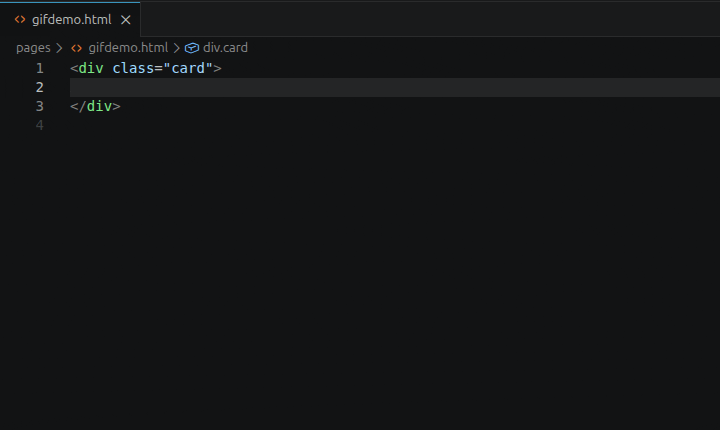
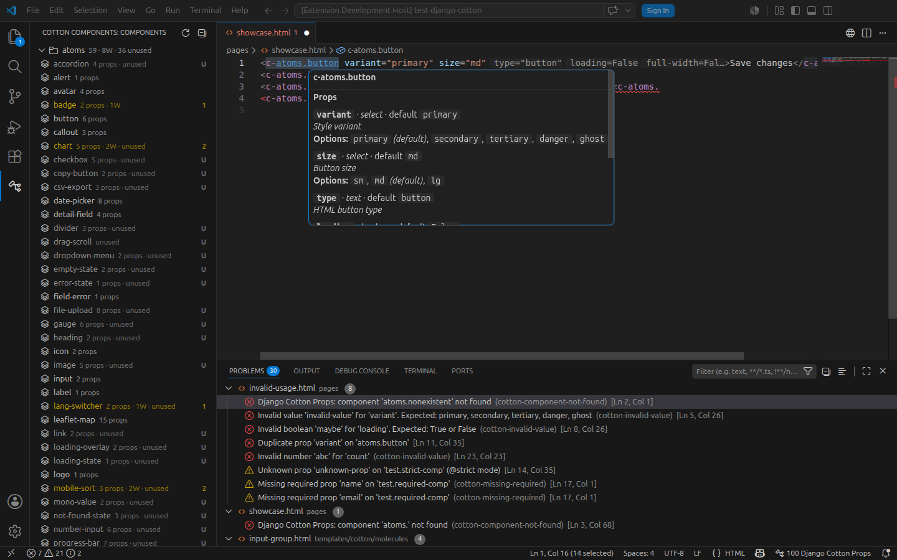
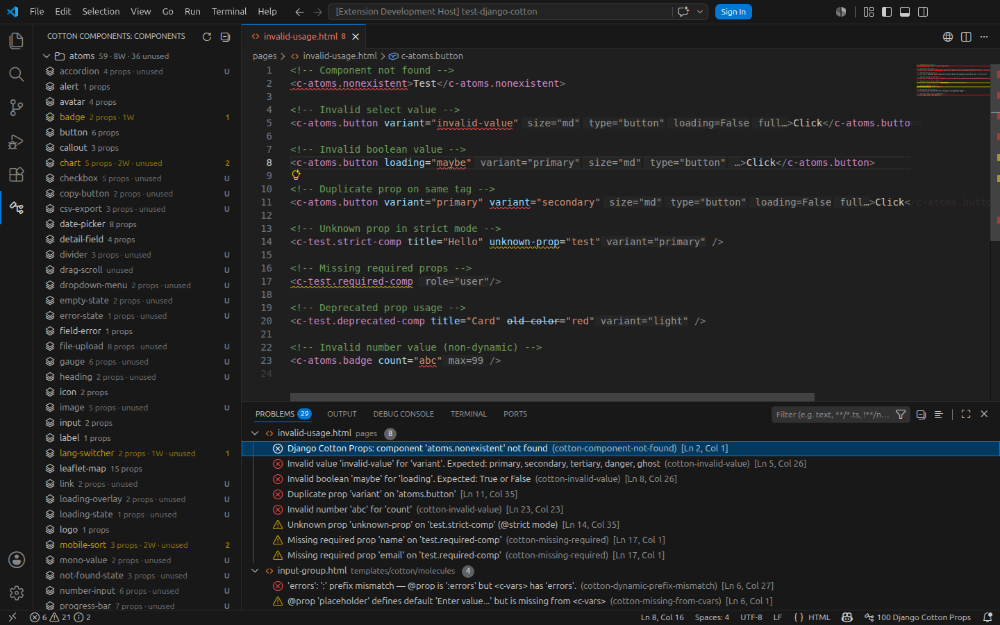

## The problem

Coming from Angular you take the Angular Language Service for granted: you write a component and
the editor completes it, and **its props have IntelliSense too**. The editor understands the
component model, not just the text.

Working with Django and Cotton, that disappears. There is a plugin, but it is very simple.

And I work daily with atomic components on Cotton, Alpine, Tailwind and HTMX. Without IntelliSense,
every component meant remembering from memory which props it accepted, and finding the mistake at
runtime instead of while typing.

Something proper was missing, so I built it.

## What it is

A Visual Studio Code extension that teaches the editor the
<a href="https://django-cotton.com/" target="_blank" rel="noopener noreferrer">Django Cotton</a> component model. It knows which components exist in the
project and which props and slots each one accepts, and uses that to autocomplete, show
documentation on hover and flag mistakes as you type.

What it does, concretely:

- **Autocomplete** for components and for their props.
- **Self-documentation**: the component's own documentation on hover.
- **Go to definition** from any tag.
- **Component tree** to navigate them, with search inside it.
- **19 diagnostics** across errors, warnings and hints, each with its quick fix.



### Half of one tool

[django-cotton-gallery](/en/projects/django-cotton-gallery/) does **the same job**: help you write
components and catch mistakes. What differs is where each one lives and what it can show.

<div class="table-scroll">
<table>
  <thead>
    <tr><td></td><th scope="col">props</th><th scope="col">gallery</th></tr>
  </thead>
  <tbody>
    <tr><th scope="row">Where</th><td>Inside the editor</td><td>In the browser</td></tr>
    <tr><th scope="row">When</th><td>While you type</td><td>While you look</td></tr>
    <tr><th scope="row">Previews</th><td>No</td><td>Yes</td></tr>
  </tbody>
</table>
</div>

This one does not preview because it is editor tooling, and the editor does not render your
project. That one does, because it runs inside it. They are the two places component work happens.

## Decisions

### Write it from scratch

**Context.** A Django Cotton plugin already existed, but it falls short in three concrete ways —
and those three are exactly what I missed day to day:

- IntelliSense is not complete.
- **There is no way to document a component.** Whoever uses it has nowhere to read what it does.
- **It warns about nothing.** You write a prop with an invalid value and the editor stays quiet;
  the error shows up at render time.

**Decision.** Write a new extension from scratch. Not a fork, not an extension of the existing one:
those three gaps are not features missing on top of what is there, they follow from the editor
having no model of the components. Without that model there is no documentation to show and no
prop to validate, so the model had to be built first.

**What came out of it:**

<div class="table-scroll">
<table>
  <thead>
    <tr><th scope="col">Gap</th><th scope="col">What I built</th></tr>
  </thead>
  <tbody>
    <tr><th scope="row">Incomplete IntelliSense</th><td>Real IntelliSense: components, props and slots</td></tr>
    <tr><th scope="row">No documentation</th><td>Component self-documentation, on hover</td></tr>
    <tr><th scope="row">No warnings</th><td>19 diagnostics across errors, warnings and hints</td></tr>
  </tbody>
</table>
</div>

And the **component tree** almost for free: once the extension knows which components exist and
where they live, listing and searching them costs nothing extra.

**Consequences.** The user pays for it: **documenting a component stops being optional**. The
extension does not guess props, so if you do not declare them you get neither autocomplete nor
diagnostics. That is work you were not doing before, in exchange for the editor knowing what you
are talking about.

## How it works

**Discovery.** Components are detected by regular expression over a configurable directory, with a
sensible default for the normal case. The walk lives in
[`src/core/scanner.ts`](https://github.com/velezanthony/django-cotton-props/blob/main/src/core/scanner.ts)
and the patterns in
[`src/core/regex.ts`](https://github.com/velezanthony/django-cotton-props/blob/main/src/core/regex.ts).

**Declaration.** Each component declares its props in template comments, alongside Cotton's own
`<c-vars>`:

```django
{# @prop title:text | required | description:Card title #}
{# @prop variant:select | default:primary #}
<c-vars title variant="primary">
```



That yields the name, the type (`text`, `number`, `boolean`, `select`…), whether it is required,
its default and its description. That is what feeds autocomplete, hover documentation and
diagnostics.

**The rules.** Nineteen, each with its own code, grouped by where they fire: **definition rules**
run inside the component itself and check that the `@prop` annotations and the `<c-vars>` agree;
**usage rules** run wherever the component is written. They live in
[`src/core/providers/diagnostics/`](https://github.com/velezanthony/django-cotton-props/tree/main/src/core/providers/diagnostics).

Every one carries a `source` and a `code`, so the Problems panel can filter down to a single rule:

```
django-cotton-props(duplicate-usage-prop)
```



**Strict mode.** Optional, via `@strict`: it errors when you pass a prop that was never declared.

And there is the detail that makes it genuinely useful. In Cotton, `{{ attrs }}` spreads every
attribute you pass onto the element. **If a component does not include `{{ attrs }}`, any
undeclared prop is dropped silently** — nothing fails, it simply never arrives. Strict mode turns
that silence into an error in the editor.

## Limits

**Detection is regex-based.** Write a component in an odd enough way — something outside what the
extension considers a component — and the pattern does not match it, so the tool cannot see it.
There is no parser behind it.

**And the documentation is mandatory.** An undeclared component is an invisible component.

## What I learned

This is my first VS Code extension. It holds everything I knew when I started, and a good deal of
what I picked up along the way.

The part that surprised me most: **VS Code runs on Electron**, and that is where its cross-platform
behaviour comes from. The extension does nothing about it — the same code runs on Linux, macOS and
Windows.

## Status

Tagged `v1.0.0` in the repository. Open source, MIT licensed, with tests and CI/CD.

**Not on the VS Code Marketplace yet**: the submission keeps being rejected over copy that does not
meet their policies, which I am still working through — the review does not say which copy.

It is the tool I work with every day.
